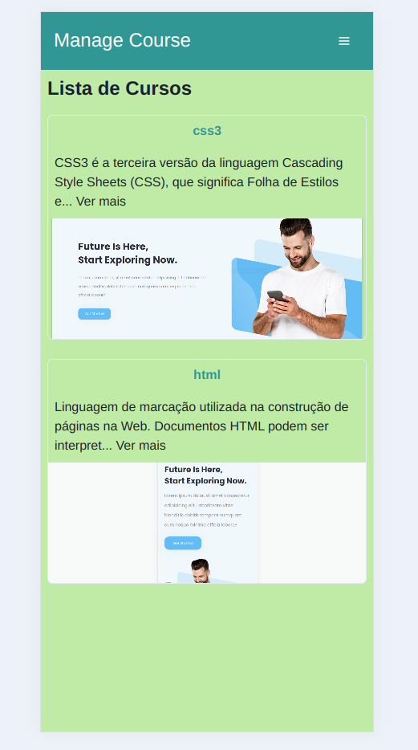

# Manage Video

Este projeto é uma aplicação web que permite upload, visualização de videos e geração de relatórios de cursos. A aplicação é construída com **React** no frontend e **Ruby on Rails** no backend, utilizando **Chakra UI** para o design e uma API REST para a comunicação entre cliente e servidor.

## Funcionalidades

- **Visualização de Cursos**: Listagem de cursos com informações como ID, título, descrição, data de término e espaço ocupado.
- **Filtragem de Cursos**: Possibilidade de filtrar cursos pela data de término.
- **Download de Relatórios**: Geração e download de relatórios em formato CSV.
- **Navegação Intuitiva**: Botões para voltar à página anterior e filtrar os cursos.

## Tecnologias Utilizadas

- **Frontend**: 
  - React
  - Chakra UI
  - Axios

- **Backend**: 
  - Ruby on Rails
  - PostgreSQL
  - API RESTful

## Instalação

### Pré-requisitos

Certifique-se de que você tem o Docker e o Docker Compose instalados.

### Passos para Configuração

1. Clone o repositório:

   ```bash
   git clone https://github.com/bussularf/threewygo.git
   cd threewygo

Construa e inicie os containers do Docker:
```
docker-compose up --build
```

Execute as migrações do banco de dados:
```
docker-compose run web bin/rails db:migrate
```

Executar testes:
```
docker-compose run web bundle exec rspec
```

Acesse a aplicação no navegador em http://localhost:3001.
Acesse a Api em http://localhost:3000.



